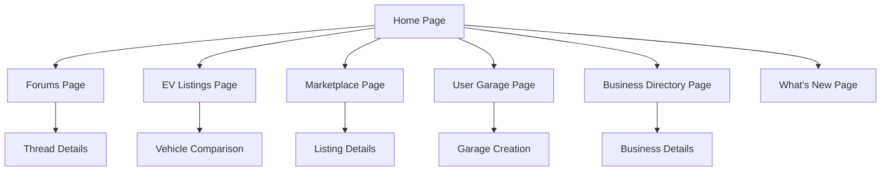

# EV Community Platform - Product Requirements Document

## 1. Product Overview
A comprehensive electric vehicle community platform that connects EV enthusiasts, owners, and businesses through forums, marketplace, vehicle showcases, and business directory features.

The platform serves as a central hub for EV community members to share experiences, discover vehicles, buy/sell EV-related items, showcase their garages, and connect with EV businesses and services.

## 2. Core Features

### 2.1 User Roles
| Role | Registration Method | Core Permissions |
|------|---------------------|------------------|
| Community Member | Email registration | Can browse forums, post discussions, create garage, use marketplace |
| Business Member | Business verification | Can post in business directory, enhanced marketplace features |
| Moderator | Admin invitation | Can moderate forums, manage content, assist users |

### 2.2 Feature Module
Our EV community platform consists of the following main pages:
1. **Home page**: navigation menu, what's new feed, featured discussions, quick stats.
2. **Forums page**: category navigation, thread listings, search functionality, post creation.
3. **EV Listings page**: comprehensive vehicle database, specification comparison, filtering tools.
4. **Marketplace page**: vehicle listings, parts/accessories, search filters, posting tools.
5. **User Garage page**: vehicle showcase, member profiles, garage creation tools.
6. **Business Directory page**: business listings, service categories, contact information.
7. **What's New page**: activity feed, trending topics, recent posts, member highlights.

### 2.3 Page Details
| Page Name | Module Name | Feature description |
|-----------|-------------|---------------------|
| Home page | Navigation Menu | Display main sections (Forums, Marketplace, Garage, Directory), user login status, search bar |
| Home page | What's New Feed | Show latest forum posts, marketplace listings, garage updates with timestamps |
| Home page | Featured Content | Highlight trending discussions, popular vehicles, active members |
| Home page | Quick Stats | Display total members, threads, messages, vehicles in showcase |
| Forums page | Category Navigation | Organize by EV brands (Tesla, BMW, Nissan, Renault), general topics (Charging, Maintenance, News) |
| Forums page | Thread Management | Create new threads, reply to posts, vote on content, bookmark discussions |
| Forums page | Search & Filter | Search threads by keywords, filter by category, sort by date/popularity |
| EV Listings page | Vehicle Database | Browse comprehensive EV catalog with detailed specifications, photos, pricing information |
| EV Listings page | Comparison Tool | Select multiple EVs for side-by-side specification comparison (range, charging, performance) |
| EV Listings page | Advanced Filters | Filter by brand, price range, range, charging speed, body type, year, availability |
| EV Listings page | Specification Details | Display detailed specs including battery capacity, motor power, charging times, dimensions |
| Marketplace page | Vehicle Listings | Post EV sales, browse available vehicles, detailed specifications, contact sellers |
| Marketplace page | Parts & Accessories | List charging equipment, parts, modifications, search by compatibility |
| Marketplace page | Search & Filter | Filter by price range, location, vehicle type, condition |
| User Garage page | Vehicle Showcase | Display member vehicles with photos, specifications, modifications |
| User Garage page | Member Profiles | Show user information, garage collection, forum activity, reviews |
| User Garage page | Garage Creation | Add vehicle details, upload photos, write descriptions, share experiences |
| Business Directory page | Business Listings | Display EV dealerships, service centers, charging networks |
| Business Directory page | Service Categories | Organize by service type (Sales, Maintenance, Charging, Insurance) |
| Business Directory page | Contact & Reviews | Business contact information, customer reviews, ratings |
| What's New page | Activity Feed | Real-time updates of forum posts, marketplace additions, garage updates |
| What's New page | Trending Topics | Popular discussions, most viewed threads, active categories |
| What's New page | Member Highlights | New member introductions, featured garages, top contributors |

## 3. Core Process
**New Member Flow:**
New users register → explore forums by EV brand → participate in discussions → create garage profile → browse marketplace → engage with community.

**Forum Interaction Flow:**
Users browse categories → select relevant brand/topic → read threads → post replies → create new discussions → bookmark favorites.

**EV Listings Flow:**
Users browse EV database → apply filters by specs/price → view detailed specifications → compare multiple vehicles → save favorites → proceed to marketplace for purchasing.

**Marketplace Flow:**
Users browse listings → use search filters → view detailed listings → contact sellers → complete transactions outside platform.

**Garage Creation Flow:**
Users access garage section → add vehicle information → upload photos → write descriptions → publish to showcase → receive community feedback.

## 4. User Interface Design
### 4.1 Design Style
- Primary colors: Electric blue (#007BFF), Clean white (#FFFFFF)
- Secondary colors: Dark gray (#343A40), Light gray (#F8F9FA), Green accent (#28A745)
- Button style: Rounded corners with subtle shadows, hover effects
- Font: Modern sans-serif (Inter or similar), 16px base size, 14px for secondary text
- Layout style: Card-based design with clean spacing, top navigation bar, sidebar for categories
- Icons: Outline style icons for navigation, filled icons for actions, EV-themed icons where appropriate

### 4.2 Page Design Overview
| Page Name | Module Name | UI Elements |
|-----------|-------------|-------------|
| Home page | Navigation Menu | Horizontal nav bar with logo, main sections, search bar, user avatar |
| Home page | What's New Feed | Card layout with post previews, timestamps, user avatars, engagement metrics |
| Home page | Featured Content | Hero section with large cards, trending badges, view counts |
| Forums page | Category Navigation | Grid layout with brand logos, discussion counts, latest activity indicators |
| Forums page | Thread Listings | List view with thread titles, author info, reply counts, last activity |
| EV Listings page | Vehicle Database | Grid layout with vehicle cards showing main photo, key specs, price range, compare checkbox |
| EV Listings page | Comparison Tool | Side-by-side table layout with expandable spec categories, highlight differences |
| EV Listings page | Filter Sidebar | Collapsible sidebar with range sliders, dropdown menus, checkbox groups, reset button |
| Marketplace page | Vehicle Listings | Grid of vehicle cards with main photo, price, key specs, location |
| Marketplace page | Search Filters | Sidebar with dropdowns, price sliders, checkboxes, clear filters button |
| User Garage page | Vehicle Showcase | Photo gallery layout, vehicle cards with specs overlay, member info |
| User Garage page | Garage Creation | Multi-step form with photo upload, dropdown selectors, text areas |
| Business Directory page | Business Listings | Card layout with business logos, ratings, service categories, contact buttons |
| What's New page | Activity Feed | Timeline layout with activity icons, user avatars, content previews |

### 4.3 Responsiveness
Desktop-first design with mobile-adaptive layout. Touch-optimized interactions for mobile users including swipe gestures for image galleries and tap-friendly button sizes. Responsive breakpoints at 768px and 1200px for optimal viewing across devices.